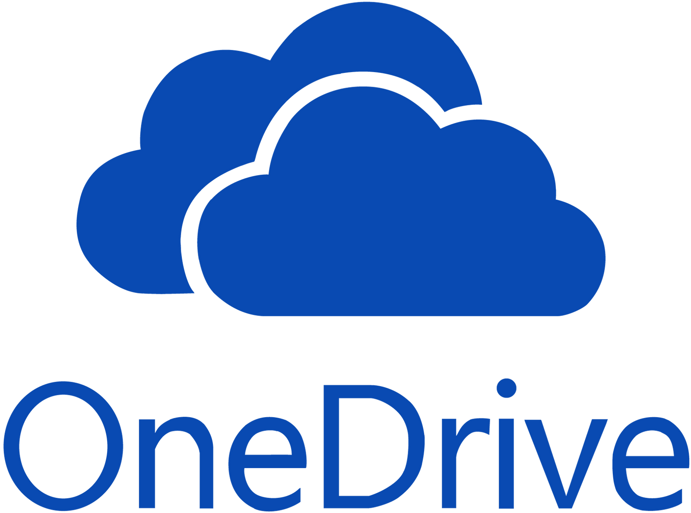

# Algoforge

---
## Pitch

**AlgoForge** est une application de **conception d'algorithmes** qui offre de nombreux avantages aux utilisateurs. Notre produit a pour objectif de faire mieux que ce que l’on connaît depuis déjà plus de 15 ans, il se veut simple, épuré et surtout rapide d’utilisation.

A la demande de beaucoup d’étudiants et d’enseignants impliqués dans le processus de création d’algorithmes, nous imaginons un **outil répondant à ces attentes**. C’est pour cela qu’il nous tient à cœur de le rendre **gratuit et open source**.

Parce que AlgoForge n’est pas seulement une application qui permet de concevoir des algorithmes c’est aussi une **clé** pour beaucoup d’étudiants vers une expérience **d'apprentissage** sans tracas inutile qui pourrait être évité avec le bon outil. 

Cet outil nous le savons, se doit de répondre à tous les problèmes de ses prédécesseurs et même si cela n’est pas tâche aisé nous savons que son existence profitera à de nombreuses personnes.

Si AlgoForge sait se différencier de ses concurrents, c’est parce qu'elle est conçue par et pour des étudiants qui ont eu le temps d'appréhender les problèmes récurrents mais aussi les avantages notables des différentes applications de conception d’algorithmes, nos concurrent qui nous ont permis de guider une réflexion dans la création d'AlgoForge.

Pour pallier aux problèmes rencontrés lors de l’utilisation de Tabula Rasa, l’interface d'AlgoForge s'adaptera à la résolution de l’écran sur lequel il est utilisé. Le rendu dynamique de l'algorithme dans l'application sera similaire au rendu obtenu en utilisant les fonctions d'exportation. 

Dans le rendu dynamique, les cases auront une taille flexible et le texte qu’elles contiennent ne reviendra pas à la ligne sauf si nécessaire pour une meilleure lisibilité. Le texte sera clairement visible dans ce mode de rendu car il aura la taille appropriée pour s'adapter à la boîte. Lors du rendu en png, jpg, pdf ou svg, la taille du texte s'adaptera aux boîtes pour éviter les débordements, et le texte ne débordera pas. 

Et comme la taille du texte sera définie pour chaque boîte individuellement, même si une instruction est un peu longue, cela n'aura pas d'impact sur la taille du texte de tout le document. De plus, puisque le rendu dynamique sera similaire au rendu final, il sera facile de prédire le rendu du logiciel avant qu'il ne soit exporté. L’application proposera également une commande de retour arrière (“CTRL+Z”) et d’autres raccourcis claviers, ce qui sera très utile pour la conception d'algorithmes.

C’est pour toutes ces raisons que notre application saura satisfaire ses utilisateurs, que ce soit les étudiants ou les enseignants du BUT informatique de Bayonne, elle fluidifiera la conception d’algorithme et rendra cette tâche redondante un peu plus agréable.

**AlgoForge** est également **indépendant du système** d’exploitation de par sa nature d’application web, fonctionnant sur n'importe quel ordinateur avec un navigateur web, ce qui la rend compatible avec tous les systèmes d'exploitation. En outre, étant basée sur le web, elle est disponible en ligne à tout moment et de n'importe où, sans **aucune limitation de temps ou de lieu**.

L'application proposera également dans la mesure du possible une **assistance à la conception** en détectant certaines erreurs de conception (exemples : Pas de conditions d’arrêt dans une structure itérative, plus de 7 sous-problèmes, …). Enfin, la plateforme collaborative permet aux utilisateurs de **travailler ensemble** sur des projets et de partager leurs algorithmes avec d'autres membres de la communauté, ce qui facilite le travail en groupe et accélère le processus créatif.

En somme, **AlgoForge** est une application de conception d'algorithmes pratique et facile à utiliser, qui offre un respect parfait du formalisme de l’IUT informatique de Bayonne et permet une collaboration entre les utilisateurs par le biais de partage d’algorithmes. Sa gratuité et sa particularité d’être une application web en font un choix idéal pour les étudiants en informatique et tous ceux qui cherchent à concevoir des algorithmes rapidement et efficacement.

Précédemment nommé I Need Algo, **AlgoForge** à changer de nom pour aborder un
aspect plus professionnel et sérieux, nous apprécions le côté humoristique du jeu de
mot avec Anne Hidalgo mais sachant qu’il ne fait en fait pas vraiment de sens avec
l’application et que cette boutade n’est intemporelle, nous avons opté pour ce
nouveau nom que nous pensons plus élégant et qui dureras dans le temps.

## Documentation

### [Lien Vers la Documentations](https://bing-chill-inc.github.io/Algoforge/)

## Identité collaborateurs

- Esteban BACKES : 
- Jokin SUARES : 
- Maxime JACOB-SAUSSEREAU : 
- Fabien SPROCQ : 
- Samuel CURRAN : 
**N.B** : Samuel CURRAN n'a pas associé son compte github lors de ces commit donc il n'apparaisse pas sur github mais existe dans le log

## Structure des dossier :

- Le dossier Spécification contient les Spécification externes du Problème Algorithmique
- Le dossier Algorithme contient les Algorithmes ainsi que leurs dictionnaires de données
- Le dossier src héberge le Code de l'algorithme
- Le dossier docs contient la documentation Doxygen pour le code source
- Le dossier Images contient les différentes images utilisé pour le repo

## Autres espaces de travail :

**Trello** | **Teams** | **Onedrive**
:---------------:|:----------------:|:--------------:
| | 
